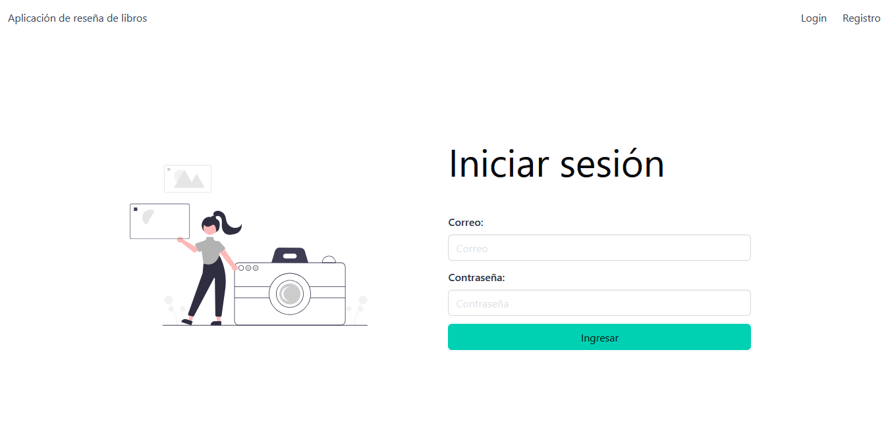
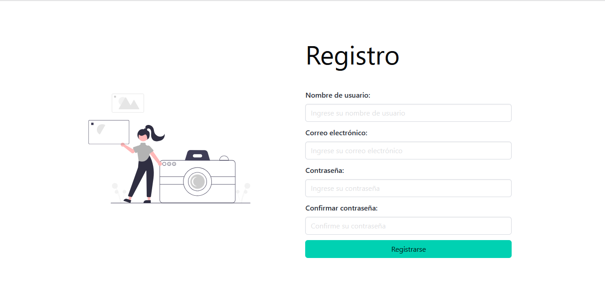
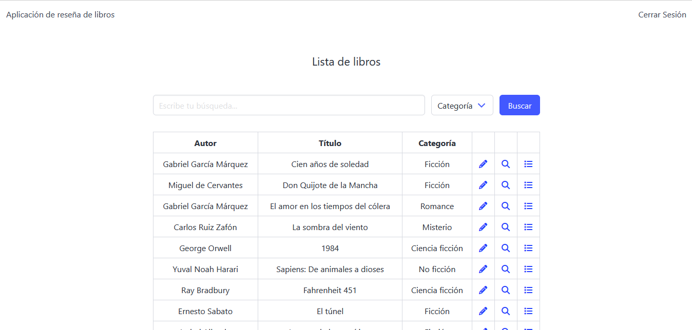
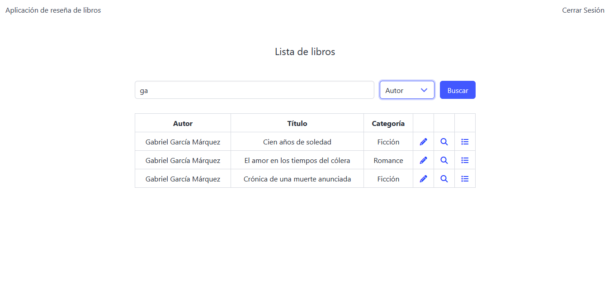

# PROCESO DE SELECCION CONTROLBOX CORP

Cree una aplicación de reseñas de libros que permita a los usuarios navegar, buscar y reseñar libros. La aplicación debe permitir a los usuarios registrarse e iniciar sesión con sus credenciales. Una vez que hayan iniciado sesión, los usuarios deberían poder navegar por una lista de libros, ver detalles de un libro, dejar reseñas para un libro y ver las reseñas dejadas por otros usuarios.


El objetivo de la presente prueba es desarrollar una aplicación 

La aplicación debería contar con lo siguiente:

1. Base de datos MySQL 

2. Frontend Angular 16.2.12

3. Backend C# .NET Core 6


### Ejecución de la Aplicación

Para ejecutar la aplicación localmente, sigue estos pasos:

1. Clona el repositorio de Git:

   git clone [https://github.com/mfquinonesc/controlbox.git](https://github.com/mfquinonesc/controlbox.git)

2. Navega al directorio del proyecto en la carpeta frontend y ejecuta el siguiente comando para instalar las dependencias:

    ```
    npm install 
    ```

3. Inicia el servidor de desarrollo con el comando:

    ```
    ng serve -o 
    ```
    Este comando abrirá automáticamente la aplicación en tu navegador predeterminado [http://localhost:4200/](http://localhost:4200/)

4. Ubicarse adentro de la carpeta backend y ejecutar el comando 

    ```
    dotnet run
    ```
    si se ejecuta desde consola o abrir la solucion desde Visual Studio.


### Capturas de pantallas
 






